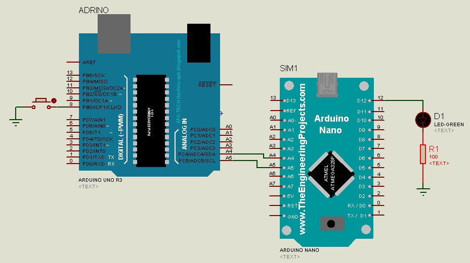
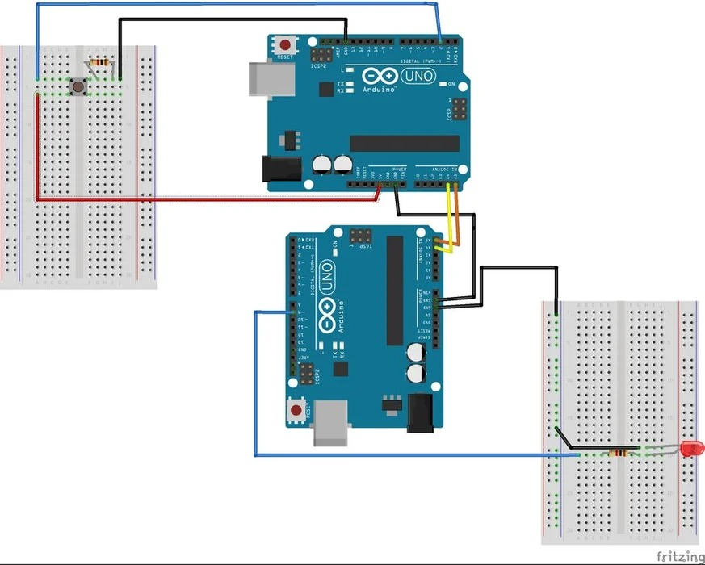
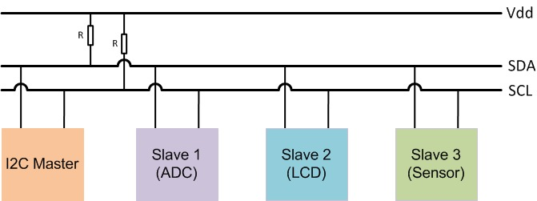
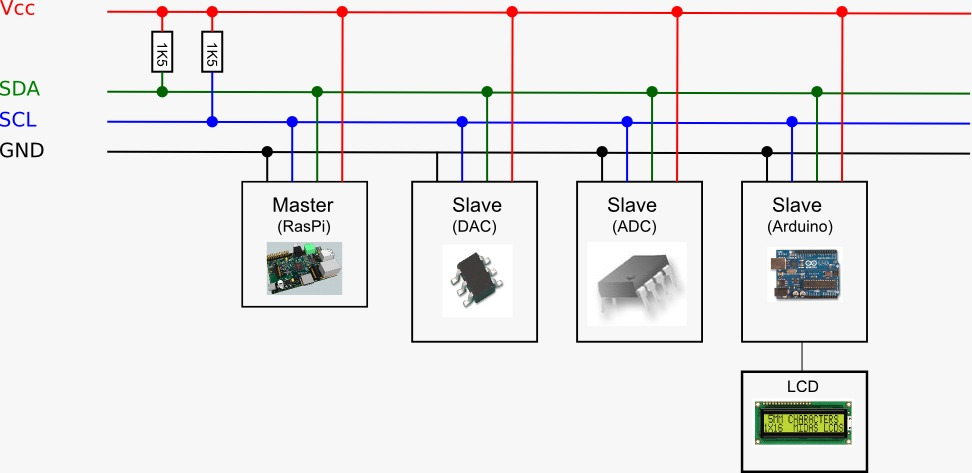
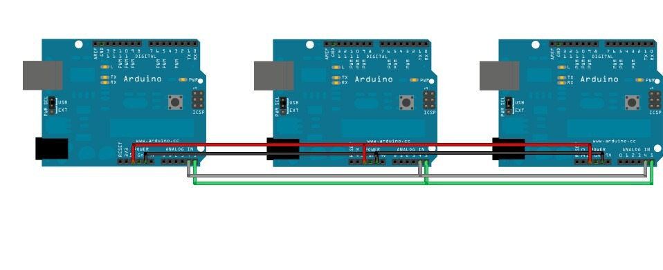
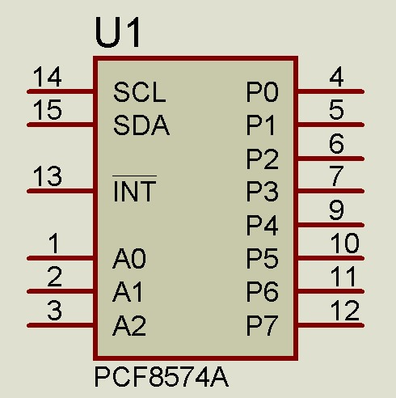
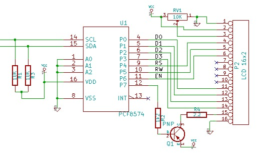
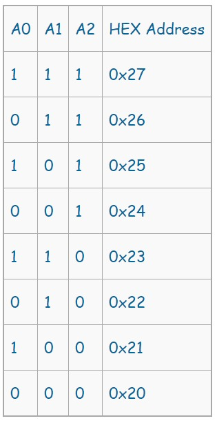

# Inter-Integrated-Circuit

@Adrin Thamrin

Yg mau coba boleh siapkan diri

@~BlacKClouD*~ : Kalo langsung praktek gimana mas?

@~Yusuf Giovanno : Ini gimana, mas?

@~Muhammad Ilham : yg perlu di persiapkan apa aja mas?

@~Sandra : Mas apakah arduino dan nodemcu bisa dpkek skligus mas dlam 1 alat

@Adrin Thamrin : Buka laptop aja dan online via wa

@~BlacKClouD*~ : Mas kalo langsung praktek dengan arduino uno dan nodemcu sama saja kan?

@Adrin Thamrin : Bisa.. hubungkan seperti digambar

Dan jangan lupa hubungkan groundnya

@~Sandra : Iya mas

@~Sandra : Mas apakah arduino dan nodemcu bisa dpkek skligus mas dlam 1 alat

@Adrin Thamrin : Bisa mas

@~Sandra : Gak bisa mas

Klo arduino nya d cbut gnti pkek nodemcu aja bisa kra2 mas?

@Adrin Thamrin : Maksudnya dicabut gimana?

@~Sandra : Iya mas cbut arduino nya

Soal nya mas klo pkek arduino aja dy gak bsa mngrim sms via telegram

@Adrin Thamrin : Ko tiba2 larinya kesini mas,,, dari mana asal usulnya?

@~Sandra : Yg buat jmuran pintar tdi mas☺

@Adrin Thamrin : Sy ga nyimak dari awal

kita bahas ini saja dulu ya,,

setelah itu kita disukusi,, boleh ya

@Adrin Thamrin : Berapa yg siap uji coba ?

Yang uji langsung di board arduino bisa seperti ini

@~Fahmi : Ini komunikasi 2 arduino lwt sda scl mas adrin y

@Adrin Thamrin : Ya benar

@~Fahmi : Laptopny dtinggal.😂 Gk bsa dcoba. Jd izin nyimak aj y mas..

@Adrin Thamrin : Dengan mengacu pada konsep dasarnya seperti pada gambar ini

@~uddinsholeh3 : Ada yang pernah pake virtuino mas?

@~Fahmi : Slave 1 2 3 brrti dijalur sda smua mas y? Sdgkan i2c master it sndiri adalah arduinonya ?

Mksdny djalur sda dan scl

@Adrin Thamrin : Ya benar mas

@~Fahmi : Ok mas. Lanjut mas ilmunya..:)

@Adrin Thamrin : Jadi gini,,, device yg ada yg memiliki interface I2C (Integrated-Integrated Circuit) dapat dhubungkan kejalur Bus yg sama, dengan alamat masing2 yg bisa kita tentukan (jika arduino), jika device jadi sudah ditentukan dari proses produksinya,, misal sensor2 maupun yg lain,, paling sering kita temui seperti Serial I2C LCD

@~BlacKClouD*~ : Berarti kalo untuk arduino dan nodemcu yg sebagai masternya itu arduinonya mas? dan nodemcu sebagai slavenya?

@Adrin Thamrin : Bisa,,, dibalik juga bisa,,, bisa lihat yg mana yg akan dijadikan Master dari sistem yg kita bangun

@Adrin Thamrin : Ingat,, berlaku sistem pull-up pada jalur bus komunikasi, sesuai dengan prinsip dasar protokol yg dimiliki sistem komuniasi I2C ini

@Adrin Thamrin : Untuk uji coba Komunikasi I2C kali ini, kita terapkan contoh yg simple saja,, dimana si Arduino Master (UNO) menjadi Pengirim data,, atau berlaku master writer .... dimana kita akan mengirim data tetapi untuk interaksi dan komunikasi datanya kita gunakan tombol

Sementara disisi Slavenya ada arduino Nano (andaikan saja sebagai nodemcu) yg berlaku sebagai Slave Reciver

Nah,, karena disini ada slave,, dalam tingkat implementasi bisa saja ada banyak slave,,, 1,2,3, dstnya

Dengan demikian,, agar bisa diketahui slave yg mana yg akan dikirim data,, maka tentu ada Alamat masing2 slave

Sementara pada uji coba kali ini hanya ada satu slave,, meski demikian juga tetap harus ada Alamatnya

Logika seerhanya kita memahami,,, alamat rumah kita bisa saja sama dengan rumah tetangga2 namun yg membedakan adalah nomor rumahnya

Dari penjelasan di atas bisa kita pahami dari gambar ini

Prinsipnya secara multiple bisa kita lakukan,,, sepanjang device/perangkat tersebut memiliki interface komunikasi I2C

~rhidhoandhika : untuk menentukan alamat slave arduino kita gmn pak?

@Adrin Thamrin : Good,,, Jika kita sendiri yg buat alatnya katakanlah seperti ARDUINO ya,,, maka dengan mudah kita tentukan alamatnya di program,,

~rhidhoandhika : sprti pada i2c lcd kan ada alamt berupa " Ox3c " dan banyak lagi nah itu menentukan nya bagaimana. atau baca datashet. tp kan datashet bukanya general d stiap boardnya

@Adrin Thamrin : Itu lain lagi,,, IC yg ada itu dapat dikonfigurasi dari pin yg disediakan,,, untuk mengubah-ubah alamatnya

artinya secara hardware dilakukan...

~rhidhoandhika : ohhh scr hardware ya pak. nh untuk secara programnya sprti apa pak

@Adrin Thamrin : Sy tidak bahas kesana dulu,, meski itu juga bagian dari komunikasi I2C,,, tp pahami dulu konsep dasar dari contoh yg kita lakukan ini

Diproteus juga bisa kita lakukan untuk LCD serial i2C itu

@~rhidhoandhika : siap pak

kita imbangi teman2 dulu

@Adrin Thamrin : 
Baik

Ada yg bisa uji coba nda?

minimal simulasi ala proteus

Jadi ga ada ya yg bisa uji coba......

Kalau gitu sampai pembahasan konsep dasar saja dulu

@~BlacKClouD*~ : maksud dari sistem pull-up itu apa ya mas? dan apa setiap jalur sda scl perlu di hubungkan ke vcc dan resistor?

@Adrin Thamrin : pull-up itu artinya jalur I2C atau SDA dan SCL nya dibuat dalam kondisi HIGH,,, secara hardware VCC dihubungkan ke jalur sda dan scal melalui resistor

@~BlacKClouD*~ : okee baik

lalu bagaimana cara mencari alamat masing-masing master dan slavenya mas?

apa perlu dengan I2C Scanner?

@Adrin Thamrin : ya bisa dengan cara ini,,, jika memang di perangkatnya tidak ada keterangan

@~rhidhoandhika : ohhh scr hardware ya pak. nh untuk secara programnya sprti apa pak

@Adrin Thamrin : Ini akan sy jawab juga ya

@~BlacKClouD*~ : boleh pak

@~Jannen Siahaan : Fungsi resistor mempertahankan SDA dan SCL harus selalu positif atau selalu lebih besar dari nol volt

@Adrin Thamrin : Betul father,,, bentuh kalimat lainnya ini,, he

@Adrin Thamrin :

Untuk LCD yg menggunakan serial I2C menggunakan IC expander untuk interface I2C nya dengan tipe pada gambar

Artinya,, IC tersebut yg menterjemahkan data komunikasi dari master ke bagian interface lain,, ya ke LCD itu

Melalui jalur I2C yg ada tentunya

Secara skematik bisa lihat gambar ini

Lalu bagaimana kita menetukan alamat IC nya yg berlaku sebagai SLAVE,,

Maka dengan mengkonfigurasi kaki-kaki atau pin IC pada jalur A0,A1,A2

Penghubungan ke jalur negatif dan positif pada setiap jalur tersebut akan menentukan berapa alamat yg ada

kata lain dari negatif yakni logika 0 dan positif yakni logika 1

dengan mengacu pada tabel berikut untuk mengkonfigurasi kaki-kakinya kita dapat nilai alamat dari IC tersebut

Berikut table acuannya

Gimana cukup jelas?

@~BlacKClouD*~ : Jelas pak

@Adrin Thamrin : Wes cukup ya,,, soale sudah pada tidur mungkin,,, 😅

@~BlacKClouD*~ : lalu bagaimana menentukan alamat dari sisi programnya pak?

@Adrin Thamrin : di program nantinya mas gunakan library yg teredia

@Adrin Thamrin : Wes cukup ya,,, soale sudah pada tidur mungkin,,, 😅

@~BlacKClouD*~ : Yahh lagi seru padahal😂

@Adrin Thamrin : dari fungsi2 yg tersedia,, maka dapat dimuat dari alamat tersebut

@Adrin Thamrin : https://arduinoinfo.mywikis.net/wiki/LCD-Blue-I2C

Untuk selengkapnya dan proses uji coba mas,,, bisa mengacu ke sini,,,

@~BlacKClouD*~ : pak next time request pembahasan tentang komunikasi rest api dong🙏

@Adrin Thamrin : Kalau untuk topik itu sy ga bisa,,, jagonya beliau ini Pak @Jannen Siahaan  dan ada beberapa yg lain yg bisa

@~heru setiawan : 👍 pak dosen, tak bosan2 sharing ilmu..

@~BlacKClouD*~ : Okee baik pak

Makasih banyak ilmunya pak🙏🙏

@~rhidhoandhika : wah sangat paham saya pak. nah bri kalau mau tambah lcd pake i2c bisa saja ya pak

